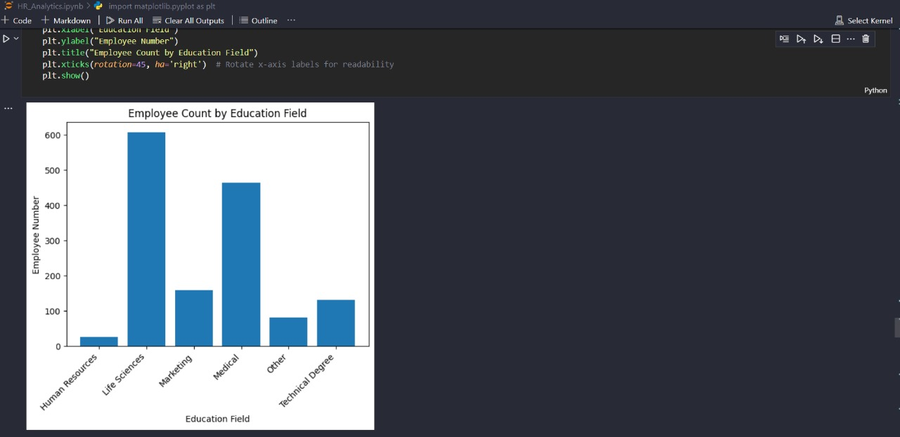
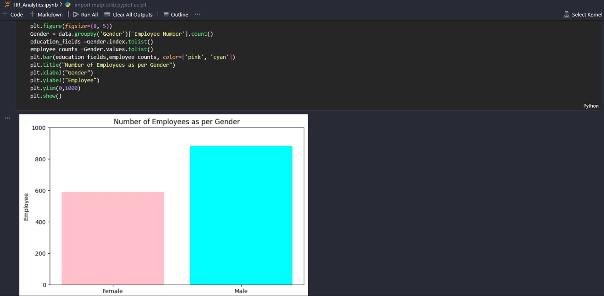

# HR Analytics Notebook

This notebook focuses on analyzing HR data to uncover insights and patterns. It is designed for professionals and researchers in human resources and data analytics, enabling them to explore employee data effectively.

## Table of Contents

1. **Introduction**
2. **Problem Statement**
3. **Data Loading and Preprocessing**
4. **Exploratory Data Analysis (EDA)**
5. **Visualizations**
6. **Real-Life Applications**
7. **Insights and Conclusion**

## Prerequisites

To run this notebook, ensure you have the following Python libraries installed:

- `pandas`
- `matplotlib`

You can install these libraries using:

```bash
pip install pandas matplotlib
```

## Usage

1. Clone or download this repository.
2. Open the `HR_Analytics.ipynb` file in Jupyter Notebook or JupyterLab.
3. Run the cells sequentially to execute the analysis.

## Problem Statement

Organizations often struggle with high employee turnover, productivity loss, and suboptimal workforce planning. The challenge lies in identifying patterns in HR data to predict and address potential issues such as employee attrition, underperformance, and resource misallocation.

## Features

- Data preprocessing for HR datasets
- Exploratory Data Analysis to uncover trends
- Visualizations for insightful representation of HR metrics

## Real-Life Applications

This HR Analytics notebook can be applied in various scenarios, including:

- **Employee Attrition Prediction:** Identify employees at risk of leaving and develop retention strategies.
- **Performance Analysis:** Analyze factors influencing employee performance and productivity.
- **Workforce Planning:** Optimize staffing levels and forecast future workforce requirements.
- **Diversity and Inclusion Metrics:** Measure and improve workplace diversity and inclusion efforts.

## Outputs

The notebook generates visualizations and descriptive statistics to help understand the dynamics of the HR dataset.



## Important Insights

- Employees with fewer years in the company and low engagement scores are more likely to leave.
- Departments with higher workloads show a higher rate of absenteeism.
- Competitive compensation packages are a key factor in employee retention.
- Consistent training programs significantly improve overall performance metrics.

## Conclusion

This notebook provides a comprehensive framework for analyzing HR data. By leveraging the insights generated, organizations can make informed decisions to improve employee satisfaction, optimize resource allocation, and enhance overall organizational performance.

## Contributing

Contributions to enhance the notebook are welcome. Feel free to fork this repository and submit a pull request.

## License

This project is licensed under the MIT License. See the LICENSE file for details.
